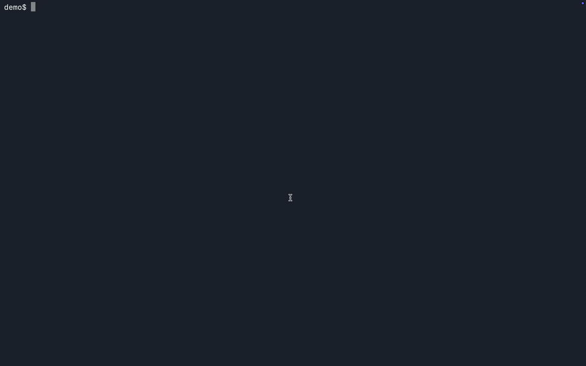
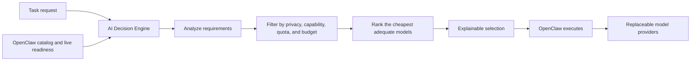

# AI Decision Engine

**A local-first, privacy-aware router that selects the cheapest adequate AI model for each task.**




AI Decision Engine classifies a request, filters models that cannot safely or reliably serve it, and returns an explainable selection. v0.1.0 is an early portfolio release, not a production-maturity claim.

## The problem

Hardcoding one model ignores the trade-offs that change from task to task: reasoning quality, privacy, cost, latency, context, quota, and live availability. A local model may be sufficient for a simple request, while a demanding analysis may justify an explicitly permitted cloud route.

## Product principles

- **Cheapest adequate, not universally best.** Match model capability to the task instead of defaulting to the most powerful option.
- **Privacy is a constraint, not a preference.** Keep requests local unless cloud processing is explicitly allowed.
- **Readiness beats configuration.** A model is ineligible unless authentication, quota, and live probes indicate that it can run.
- **Every decision should be explainable.** Return selection evidence, rejection reasons, confidence, and fallback order.
- **Selection and execution stay separate.** The Decision Engine chooses; OpenClaw owns credentials and execution.

## How it decides

| Request | Verified selection | Why |
|---|---|---|
| Simple task | Qwen (`ollama/qwen3:8b`) | Local quality is adequate, so no cloud permission or metered API spend is needed. |
| High reasoning | GPT-5.6 Sol (`openai/gpt-5.6-sol`) | The local model misses the quality threshold; the high-reasoning tier prefers GPT-5.6 Sol. |
| Extreme reasoning | Claude Opus 4.8 (`anthropic/claude-opus-4-8`) | The extreme-reasoning tier prefers Opus when its authentication, probe, and quota are ready. |

Gemini 3.1 Pro Preview is excluded when its live readiness signal reports rate limiting or unavailable quota. Claude Sonnet 5 is configured but is not claimed as ready without a successful model probe.

## Architecture



The Decision Engine owns analysis, eligibility, ranking, explanations, and API-spend controls. OpenClaw owns authentication, subscription state, quotas, sessions, and execution. Selection-only mode never invokes a model.

## What works today

- Local-only privacy by default; cloud routing requires explicit permission.
- Provider-scoped OpenClaw discovery with live probe and quota signals.
- Deterministic selection for chat, coding, and reasoning requests.
- Explainable assessments, rejections, confidence, and fallback order.
- Selection-only decisions or authenticated execution through OpenClaw Gateway.
- Transactional API-budget reservations and charge-aware fallback accounting.

Images, embeddings, tool calls, schema-validated output, and current-information retrieval are not end-to-end capabilities in v0.1.0.

## How v0.1.0 is evaluated

- Does it choose the expected model for the three defined task tiers?
- Does it reject unavailable, quota-limited, or privacy-ineligible models?
- Can a reviewer understand why the selected model won?
- Does selection-only mode avoid model execution and metered API spend?

## Three verified routing examples

```bash
# Simple task → Qwen
uv run ai-decision-engine "Explain this simply" --select-only --show-rejections

# High reasoning → GPT-5.6 Sol
uv run ai-decision-engine "Evaluate three monetization strategies and recommend a staged launch." \
  --allow-cloud --select-only --show-rejections

# Extreme reasoning → Claude Opus 4.8
uv run ai-decision-engine "Compare deployment approaches, failure modes, and migration trade-offs." \
  --allow-cloud --select-only --show-rejections
```

The demo records genuine selection-only output from a self-hosted Linux runtime; only waiting periods are trimmed. See [evaluation](docs/evaluation.md) for the full prompts, evidence, and limitations.

## Quick start

Requires Python 3.12+, [`uv`](https://docs.astral.sh/uv/), and a configured Ollama/OpenClaw runtime.

```bash
uv sync --dev
cp .env.example .env
uv run ai-decision-engine "Explain this simply" --select-only --show-rejections
```

Never put provider credentials in repository files. OpenClaw owns provider authentication; see [deployment](docs/deployment.md).

## Why v0.1.0 stops here

This release tests the product's riskiest assumption: whether a routing policy can make a useful, explainable model decision from task requirements, privacy constraints, cost, and live readiness signals.

v0.1.0 deliberately proves the selection loop before expanding the execution surface. Images, tool use, retrieval, additional providers, and production deployment are deferred until the policy can be evaluated repeatedly and calibrated with stronger evidence.

## What comes next

| Priority | Product question | Evidence required |
|---|---|---|
| **Next: evaluation and calibration** | Does the policy consistently choose an adequate model across a broader task set? | Repeatable cases, selection agreement, rejection accuracy, latency, and cost measurements. |
| **Then: feedback and policy tuning** | Can user outcomes improve thresholds and fallback decisions? | Structured feedback, failure categories, and versioned policy comparisons. |
| **Then: capability expansion** | Which workflows justify images, tools, retrieval, or structured output? | Validated use cases with measurable value beyond text routing. |
| **Later: operational hardening** | What is required beyond a portfolio environment? | Observability, recovery testing, security review, deployment automation, and service-level targets. |

> **Not prioritized in v0.1.0:** a model marketplace, broad provider coverage, a polished UI, autonomous tool execution, or production-scale deployment. These add surface area before the core routing policy is sufficiently calibrated.

## Documentation

- [Architecture](docs/architecture.md)
- [Evaluation](docs/evaluation.md)
- [Deployment](docs/deployment.md)
- [Privacy and security](docs/privacy.md)
- [Cost model](docs/cost-model.md)
- [Design decisions](docs/decisions.md)
- [Roadmap](docs/roadmap.md)
- [Contributing](CONTRIBUTING.md) · [Changelog](CHANGELOG.md)
