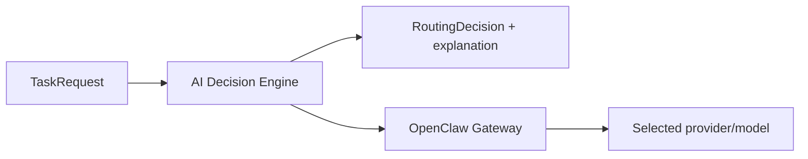

# Architecture

The decision engine depends on provider and catalog interfaces, not vendor clients. Canonical model references (`provider/model`) are policy data passed unchanged to an execution runtime.

OpenClaw is the authentication and execution boundary for OAuth, subscriptions, API credentials, quota state, sessions, tools, and model generation. `DecisionEngine.run` always delegates its canonical model selection to `OpenClawGatewayProvider`. `OllamaProvider` remains an independent infrastructure adapter for availability checks and direct adapter integration tests, but the Decision Engine never invokes it for generation.

Selection and execution are separate. `select` performs analysis, discovery, eligibility, cheapest-adequate ordering, and explanation. `run` reuses the same preparation and then executes candidates. OpenClaw callers normally use selection-only; otherwise calling Gateway from an active OpenClaw workflow can create an unnecessary nested agent run.

`OpenClawCliCatalog` invokes configurable read-only commands without a shell, applies a timeout, parses only JSON output, and caches snapshots briefly. For the validated self-hosted OpenClaw `2026.7.1-2` runtime, it queries each approved provider with `models list --provider <provider> --json`, merges rows by canonical `provider/model` key, and combines them with configured-model context plus the live `auth.probes.results`, `auth.oauth`, and `auth.providers` readiness data. Successful per-model probe latency is retained as numeric runtime metadata; profile IDs, labels, emails, and credential material are never copied into routing output. The provider list is configurable through `ADE_OPENCLAW_CATALOG_PROVIDERS`. One failed or malformed provider catalog is isolated as `catalog-unavailable`; discovery continues unless every provider catalog fails. This is a compatibility workaround for the release's broken combined-catalog path, not a change to routing policy.

Catalog presence is not readiness. Only the intersection of catalog presence, explicit approval, configuration, successful probe, usable authentication, and usable quota enters routing.

API-billed candidates reserve their maximum cost transactionally before execution. Local, subscription, and free-tier routes do not consume API budget, but subscription/free-tier quota remains an availability constraint.

## Capability-first routing

`TaskRequest` carries explicit reasoning complexity, coding complexity, multimodal need, and latency preference. The replaceable analyzer converts these signals—and conservative structural evidence when explicit complexity is absent—into required service capabilities and an adequacy threshold. Capability inference does not depend on keyword maps.

The policy computes an assessment for every model and then filters privacy, service support, context fit, runtime readiness, quota, capability-specific adequacy, and budget. Adequate local execution is decisive. Otherwise, incremental monetary cost wins, followed by estimated latency, capability score, and a stable model-reference tie-breaker.

The decision contains execution provider, estimated cost and latency, structured model assessments, exclusions, ordered fallbacks, confidence, and a readable report. Reasoning, coding, speed, cost, privacy, context, availability, quota, vision, and tool-use constraints are visible rather than collapsed into a single opaque score. Model quality and latency numbers are provisional policy inputs pending evaluation; routing confidence measures evidence and adequacy margin, not answer correctness.

